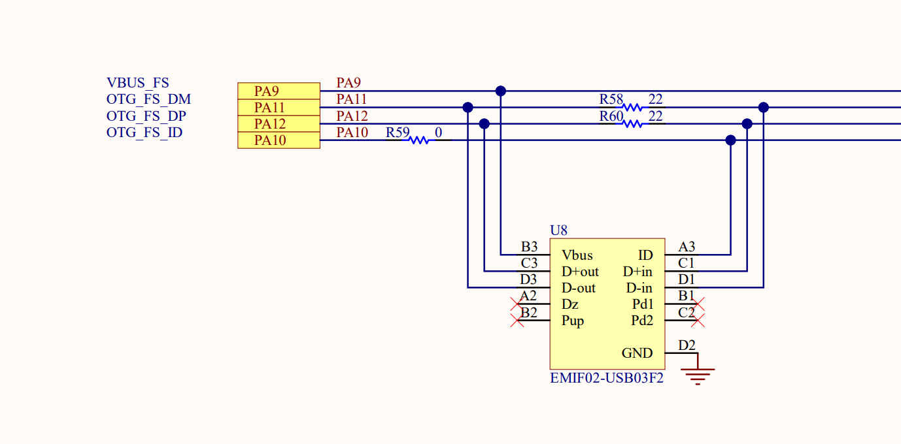
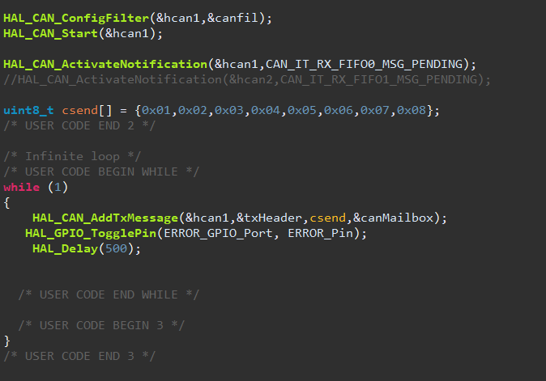

# STM32F407VG-DISC1 (rev_E01)
STM32F407G-DISC1 with STM32F407VGT6 MCU

## HSE 8 MHZ 

PH0 and PH1 pins are disconnected in default, SB13 and SB14 need to be soldered to connect external pins. The external clock reaches the MCU correctly.HSE working ok on MX_tester code
# FSMC Pinout

    
    

| LCD | STM32 | Discription |
|-----------|-----------|-----------|
| D 0  | PD 14  | / |
| D 1  | PD 14  | / |
| D 2  | PD 0  | / |
| D 3  | PD 1  | / |
| D 4  | PE 7  |/|
| D 5  | PE 8  |/|
| D 6  | PE 9  |/ |
| D 7  | PE 10  |/|
| D 8  | PE 11  |/|
| D 9  | PE 12  |/|
| D 10 | PE 13 | /|
| D 11 | PE 14 |/ |
| D 12 | PE 15 |/|
| D 13 | PD 8 | /|
| D 14 | PD 9 | /|
| D 15 | PD 10 | /|
| LCD_CS | PD 7 (NE1) | LCD Chip Selection/Low->enable |
| DC | PD 11 (Ax) | Instruction/Data Register Selection |
| WR | PD 5 (NWE)| Write Action |
| RD | PD 4 (NOE) | Read Action |
| LCD_RST | \ | Reset Low->reset PULLUP!!|
| BL | PB 0 | Backlight Adjustment |

Topic with FSMC adress explanation
https://community.st.com/t5/stm32-mcus-touchgfx-and-gui/fsmc-why-do-i-need-it/td-p/448272?fbclid=IwZXh0bgNhZW0CMTAAAR3YomTOtSPmas-gZEZ78_OA-TBQG1XqcFvMaPbQt9ZJvrhqtkcoQAQAtso_aem_AYiBd74xSdkQfUi5olx5jEQZkNxZfcnN8qRbCv7A_GU4cjiZqksG3wuHf87tbrJyksve9GAdm39Xd6265T56Vvqb

# Understanding FSMC

STM tutorials from other MCU
https://www.st.com/resource/en/product_training/stm32l4_memory_fsmc.pdf
https://www.st.com/resource/en/product_training/STM32MP1-Memory-Flexible_Memory_Controller_FMC.pdf

# FSMC STM32 Configuration

# USEFULL LINKS

### Display WIKI Page
https://www.waveshare.com/wiki/4inch_Resistive_Touch_LCD

### STM32F4DISCOVERY ST Page
https://www.st.com/en/evaluation-tools/stm32f4discovery.html#tools-software

### STM32F4407vg ST Page
https://www.st.com/en/microcontrollers-microprocessors/stm32f407vg.html#overview

### Example of LCD FMC setup
https://controllerstech.com/stm32-fmc-how-to-configure-for-lcd/

### FSMC STM video 1
https://www.youtube.com/watch?v=0wOWzdmsVlQ&list=LL&index=2&ab_channel=1sand0s

### FSMC setup example video 2
https://www.youtube.com/watch?v=hfeKMZXt2L8&list=LL&index=1&ab_channel=RobertoBenjami

### Understunding FSMC !!!!!!!!!!!!!
https://www.youtube.com/watch?v=Sh2zQbqq5_s&ab_channel=LogicVoltage

### 3.5 inch example
https://mydiyelectronics.wordpress.com/2020/08/03/3-5-lcd-module-development/

### FSMC LCD ALIBABA !!!!!
https://topic.alibabacloud.com/a/re-learning-stm32-vii-fsmclcd_8_8_31261556.html

### LVGL
https://forum.lvgl.io/t/corrupted-display-stm32h743-when-trying-to-optimize-performance/10559

### Korea
https://www.programmersought.com/article/2535598703/

https://www.fwqtg.net/stm32cubemx%E6%95%99%E7%A8%8B22-fsmc-8080%E5%B9%B6%E8%A1%8C%E6%8E%A5%E5%8F%A3tft-lcd%E9%A9%B1%E5%8A%A8.html

https://blog.csdn.net/weixin_44412311/article/details/133891855

### Stack
https://stackoverflow.com/questions/36748271/stm32f4-fsmc-with-tft-lcd

# LVGL library
https://forum.lvgl.io/t/stm32-nt35510-fsmc/2251

# Screen Docs

# external ram?
https://community.st.com/t5/stm32-mcus-products/tft-lcd-with-fsmc-and-external-ram/td-p/497273
https://community.st.com/t5/stm32-mcus-touchgfx-and-gui/sram-fsmc-framebuffer-gt-8080-lcd-fsmc-dma-transfers-example/td-p/235504
https://community.st.com/t5/stm32cubeide-mcus/how-to-use-stm32f407-fsmc-memory/td-p/195061

# touchGFX
https://support.touchgfx.com/docs/category/basic-concepts
https://www.youtube.com/watch?v=SRQD8JMeg_k&ab_channel=embryonic.dk

# CAN 
https://www.youtube.com/watch?v=KHNRftBa1Vc&ab_channel=ControllersTech
https://controllerstech.com/can-protocol-in-stm32/
https://www.dailyduino.com/index.php/2020/06/01/stm32-can-bus/

For now working only on CAN1 -> MASTER, CAN 1 can be on PD0(RX) PD1(TX) which conflicts FSMC, alternatively it can be placed on PA11(RX) and PA10(TX) but on DISCO booard they are connected to USB. 

CAN2 working??? -> TBA 

## hardware and software config

PD0(RX) -> RTX
PD1(TX) -> CTX
CANL -> CANL
CANH -> CANH

ANALOG:
DIO1(RX) -> RTX
DIO1(TX) -> CTX

CAN1/CAN2 working : 
https://community.st.com/t5/stm32-mcus-products/using-can2-slave-without-can1-master/td-p/366990
https://community.st.com/t5/stm32-mcus-products/can2-in-stm32f407-is-not-working/td-p/52287